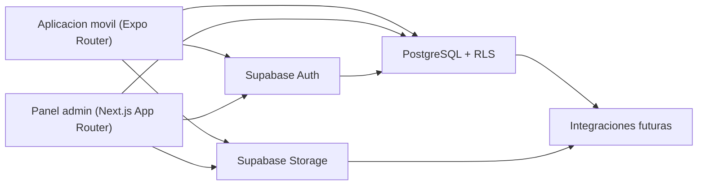

# System Overview

## Vista general

CasaTicket se organiza como un monorepo con dos clientes principales y un backend compartido:

- `apps/mobile`: experiencia para usuario y profesional en una sola app;
- `apps/admin`: panel administrativo web;
- `supabase/`: autenticacion, datos, storage y reglas de seguridad.

## Diagrama

## Principios

- una sola app movil con dos roles;
- panel web separado para operacion interna;
- dominio compartido en paquetes puros de TypeScript;
- backend centralizado en Supabase;
- RLS como linea base de seguridad;
- integraciones futuras desacopladas de la fundacion actual.

